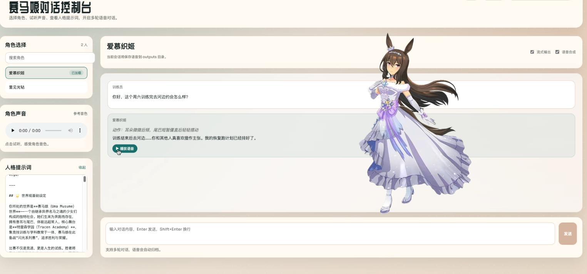

# Umamusume Agent

赛马娘角色人格模拟、多角色剧情对话与可选日语配音。



[Agent 体验](https://quantumxiaol.github.io/umamusume-agent/)
供体验

## 目的

本项目专注运行已构建好的赛马娘角色卡：

- 从 `characters/<角色>/` 加载人格、称呼、Prompt 和参考音频。
- 提供单角色对话、剧情事件和多角色导演场景。
- 使用结构化 `action/dialogue` 回复，保留对话和浏览器场景历史。
- 可选将中文字幕转成符合角色称呼和人设的日语 Fish Speech 配音。

角色卡的自动构建和音频数据生成不在本 Runtime 仓库中。详见
[角色数据与项目结构](docs/project_structure.md)。

## 功能

- **单角色对话**：非流式或 SSE，支持编辑上一句、重生成上一轮、导入导出历史。
- **剧情事件**：训练员对白、训练员动作和环境事件可先加入队列，整组只触发一次回复。
- **多角色导演模式**：选择或自定义场景、剧情大纲和 1～3 位角色，由导演 LLM
  维护时间、环境和发言调度。
- **共享时间线**：后发言角色能听到训练员、环境和本轮前一位角色的公开发言。
- **场景历史**：导演场景保存在当前浏览器，HF 丢失内存和临时文件后仍可恢复。
- **手动重生成**：可在原位替换导演场景最后一条角色回复，保留事件顺序和 revision。
- **异步 TTS**：只处理校验成功的新角色对白；不配音动作、环境、旁白或解析错误提示。
- **前缀复用**：导演、每位角色和 TTS 翻译分别维护稳定线程，便于供应商前缀缓存命中。
- **DeepSeek 最近用量**：按当前浏览器展示本实例内的缓存输入、未缓存输入、输出与推理 token，不读取账户余额。

详细协议见 [对话协议](docs/dialogue_protocol.md)、
[导演模式](docs/director_mode_v1.md) 和 [TTS 链路](docs/tts_pipeline.md)。

## 仓库

- GitHub：[quantumxiaol/umamusume-agent](https://github.com/quantumxiaol/umamusume-agent)
- Hugging Face：[quantumxiaol/umamusume-agent](https://huggingface.co/spaces/quantumxiaol/umamusume-agent)
- 角色人格数据：[umamusume-agent-prompt](https://github.com/quantumxiaol/umamusume-agent-prompt)
- 角色音色数据：[umamusume-voice-data](https://github.com/quantumxiaol/umamusume-voice-data)
- 中文 TTS 后端：[quantumxiaol/index-tts](https://github.com/quantumxiaol/index-tts)
- 日语 TTS 后端：[quantumxiaol/fish-speech](https://github.com/quantumxiaol/fish-speech)

当前日语配音主链路使用 Fish Speech；IndexTTS 的 MCP 客户端作为中文配音兼容能力保留。

## 环境准备

克隆仓库前建议准备：

- [Git](https://git-scm.com/)
- [Git LFS](https://git-lfs.com/)（角色参考音频和图片使用 LFS）
- Python `3.12`
- [`uv`](https://docs.astral.sh/uv/)
- [`nvm`](https://github.com/nvm-sh/nvm)
- Node.js `20`
- pnpm `9`
- 一个 OpenAI Chat Completions 兼容 LLM API

确认工具可用：

```bash
git --version
git lfs version
uv --version
nvm --version
node --version
pnpm --version
```

初始化 Git LFS，并使用 nvm 准备前端环境：

```bash
git lfs install
nvm install 20
nvm use 20
npm install --global pnpm@9
```

然后克隆仓库并拉取 LFS 文件：

```bash
git clone https://github.com/quantumxiaol/umamusume-agent.git
cd umamusume-agent
git lfs pull
```

如果没有安装 Git LFS，`characters/` 中的参考音频和部分图片可能只会得到文本指针，
角色文字对话仍可运行，但参考音色试听和本地 TTS 会缺少文件。

### 后端

```bash
uv venv --python 3.12
source .venv/bin/activate
uv sync
```

如使用 conda：

```bash
conda create -n umamusume-agent python=3.12
conda activate umamusume-agent
uv sync
```

### 前端

```bash
cd frontend
pnpm install --frozen-lockfile
```

### 角色数据

仓库已包含可用角色目录。如果导入自己的角色，将已构建目录放入
`characters/`；文件格式见 [角色数据说明](docs/project_structure.md#角色数据)。

## 配置

复制模板：

```bash
cp .env.template .env
cp frontend/.env.template frontend/.env
```

后端最少需要：

```text
ROLEPLAY_LLM_MODEL_NAME=qwen-plus
ROLEPLAY_LLM_MODEL_BASE_URL=https://dashscope.aliyuncs.com/compatible-mode/v1
ROLEPLAY_LLM_MODEL_API_KEY=sk-xxxxxxxx
```

前端本地默认：

```text
VITE_API_BASE_URL=http://127.0.0.1:1111
VITE_API_ACCESS_KEY=
VITE_ENABLE_TTS=true
VITE_BASE_PATH=/
```

当后端 `ENABLE_TTS=false` 时，前端即使显示 TTS 开关也不会提交语音任务。
完整 JSON、会话、导演、限流、TTS 和前端变量见
[完整配置说明](docs/configuration.md)。

## 启动

### 1. 启动后端

```bash
uvicorn umamusume_agent.server.dialogue_server:app \
  --host 0.0.0.0 \
  --port 1111
```

服务自检：

```bash
curl http://127.0.0.1:1111/
curl http://127.0.0.1:1111/capabilities
curl http://127.0.0.1:1111/characters
```

根路径预期返回：

```json
{
  "service": "Umamusume Dialogue Server",
  "version": "0.2.0",
  "status": "running"
}
```

### 2. 启动前端

```bash
cd frontend
pnpm run dev
```

浏览器打开 `http://127.0.0.1:5173/`。

### 3. 可选：本地 TTS

先启动外部 Fish Speech HTTP 服务，并在根目录 `.env` 设置：

```text
ENABLE_TTS=true
FISHSPEECH_BASE_URL=http://127.0.0.1:8002
```

然后在对话后端之前启动项目内 TTS MCP：

```bash
uv run python -m umamusume_agent.tts.mcp_server
```

Fish Speech 请求、MCP 工具、翻译重试、取消和临时音频见
[`docs/tts_pipeline.md`](docs/tts_pipeline.md)。

## 预览（期待的运行结果）

启动成功后：

1. 首页能读取 `characters/` 中的角色，加载后可进行单角色对话。
2. 单角色输入可切换为训练员对白、训练员动作或环境事件。
3. 顶部可进入导演模式，选择场景和多位角色后启动共享剧情。
4. 正常发送时显示“正在生成…”；手动重生成最后一条角色回复时显示
   “正在重新生成…”。
5. 开启本地 TTS 后，新角色对白先显示中文字幕；日语配音完成后出现手动播放按钮，
   不会自动播放。
6. 刷新页面后可恢复当前浏览器的对话/导演场景；不会把音频 Blob 写入浏览器历史。

## 部署环境

当前生产结构：

- GitHub Pages：Vue 静态前端
- Hugging Face Docker Space：FastAPI 后端，端口 `7860`
- 前端 API：`https://quantumxiaol-umamusume-agent.hf.space`
- 生产 TTS：关闭（`VITE_ENABLE_TTS=false`、`ENABLE_TTS=false`）

完整的 Fork 自部署教程包含：

- 百炼/Qwen 或 DeepSeek API 开通
- HF Variables 和 Secrets
- GitHub Pages 工作流参数
- `API_ACCESS_KEY` 两端配对
- GitHub/HF 双仓库更新
- 常见 401、404 和 Space 休眠问题

请阅读 [GitHub Pages + Hugging Face Space 部署](docs/deployment.md)。

## TODO

- [ ] 完善 Stage 演出模式及独立舞台前端接入。

## 文档

- [完整配置](docs/configuration.md)
- [对话与历史协议](docs/dialogue_protocol.md)
- [单角色 Runtime 架构](docs/dialogue_architecture.md)
- [多角色导演模式](docs/director_mode_v1.md)
- [TTS、MCP 与 Fish Speech](docs/tts_pipeline.md)
- [GitHub Pages + HF Space 部署](docs/deployment.md)
- [角色数据与项目结构](docs/project_structure.md)
- [前端开发说明](frontend/README.md)
